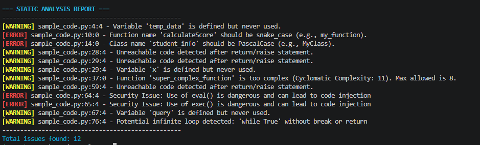
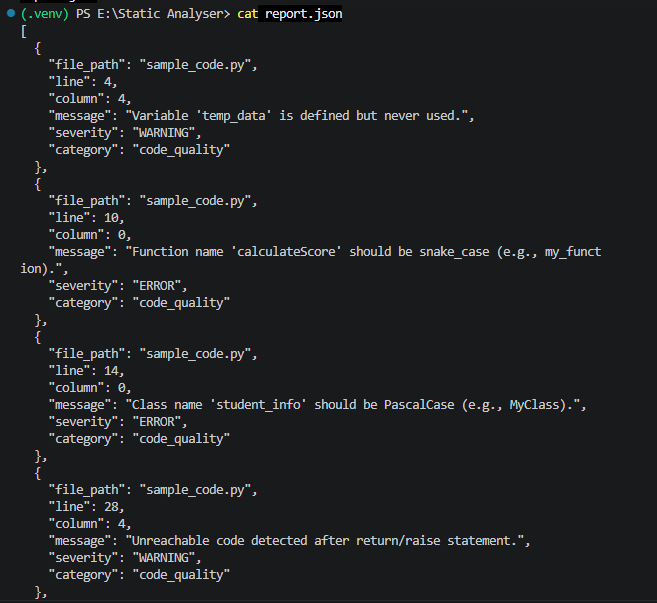

```markdown
# 🔍 Python Static Analyser

[](https://github.com/YOUR_USERNAME/YOUR_REPOSITORY/actions)

##  Highlights

*   **Improve Code Quality:** Automatically find unused variables, dead code, and naming convention mistakes.
*   **Enhance Security:** Detect dangerous functions like `eval()` and potential SQL injections before they cause harm.
*   **Boost Performance:** Identify infinite loops and inefficient string concatenations.
*   **Flexible Reporting:** Export your results in plain text, JSON, or SARIF formats.
*   **Fully Customizable:** Easily adjust rules and complexity limits using a simple JSON file.

## ℹ Overview

**Python Static Analyser** is a professional and lightweight code quality tool designed for Python developers. Writing clean, secure, and fast code can be challenging, especially in large projects. This tool helps you automatically scan your Python codebase to find hidden bugs, bad practices, and security risks.

Whether you are a solo developer trying to learn better coding habits, or a team looking to maintain high standards, this tool provides clear and helpful feedback directly in your terminal. It acts like an automated code reviewer that never gets tired!

##  Architecture

Here is a high-level overview of how the analyser processes your Python code:

```text
┌─────────────────────────────────────────────────────────┐
│                   User Input (CLI)                      │
└───────────────────────┬─────────────────────────────────┘
                        │
                        ▼
┌─────────────────────────────────────────────────────────┐
│                 analyzer.py (Main)                      │
│  - Load Configuration                                   │
│  - Parse Arguments                                      │
│  - Manage File Discovery                                │
└───────────────────────┬─────────────────────────────────┘
                        │
                        ▼
┌─────────────────────────────────────────────────────────┐
│                  core.py (Engine)                       │
│ ┌─────────────────────────────────────────────────────┐ │
│ │            CustomVisitor (AST Walker)               │ │
│ │ ┌──────────────┐  ┌──────────────┐  ┌────────────┐  │ │
│ │ │  Complexity  │  │   Security   │  │ Performance│  │ │
│ │ │   Analyzer   │  │   Analyzer   │  │  Analyzer  │  │ │
│ │ └──────────────┘  └──────────────┘  └────────────┘  │ │
│ └─────────────────────────────────────────────────────┘ │
└───────────────────────┬─────────────────────────────────┘
                        │
                        ▼
┌─────────────────────────────────────────────────────────┐
│                 reporter.py (Output)                    │
│ ┌─────────────┐   ┌─────────────┐   ┌─────────────┐   │
│ │    Text     │   │    JSON     │   │    SARIF    │   │
│ └─────────────┘   └─────────────┘   └─────────────┘   │
└─────────────────────────────────────────────────────────┘ 
```

## ⬇ Installation

Currently, the tool runs directly from the source code. You don't need complicated setups. Just clone the repository and install the required formatting library.

**Requirements:** Python 3.10 or higher.

```bash
# 1. Clone the repository
git clone [https://github.com/yeganejhi/Static-Analyser.git](https://github.com/yeganejhi/Static-Analyser.git)
cd "Static Analyser"

# 2. Install required packages (for colored terminal output and testing)
pip install colorama pytest
```

##  Usage

Using the analyser is very simple. You can analyze a single Python file or an entire directory.

**Analyze a specific folder:**
```bash
python run.py path/to/your/project
```

**Analyze a single file:**
```bash
python run.py sample_code.py
```

**Export the report to JSON format:**
```bash
python run.py path/to/your/project --format json --output report.json
```

###  Configuration (Optional)
You can customize how the analyser works by creating an `analyzer.json` file in your root directory. For example:

```json
{
  "max_complexity": 10,
  "disable_rules": ["naming-convention"],
  "enable_security": true,
  "enable_performance": true,
  "exclude_patterns": [".venv", "__pycache__", "test_*.py"]
}
```

##  Screenshots

Here are visual examples of the tool in action:

### Terminal Output Example


### JSON Output Example


##  What it catches (Examples)

Here are a few examples of what our tool can automatically detect:

*   **Security:** Use of `eval()` is dangerous and can lead to code injection
*   **Code Quality:** Variable `temp_data` is defined but never used.
*   **Performance:** Potential infinite loop detected: `while True` without break or return
*   **Style:** Function name `calculateScore` should be `snake_case`.

##  Feedback & Contributing

Open Source software grows through community! 

*   If you find a bug or have an idea to make this tool better, please open an **Issue**.
*   If you want to contribute code, feel free to fork the repository and submit a **Pull Request**. 
*   Check our tests in the `tests/` directory to see how we maintain quality.


```